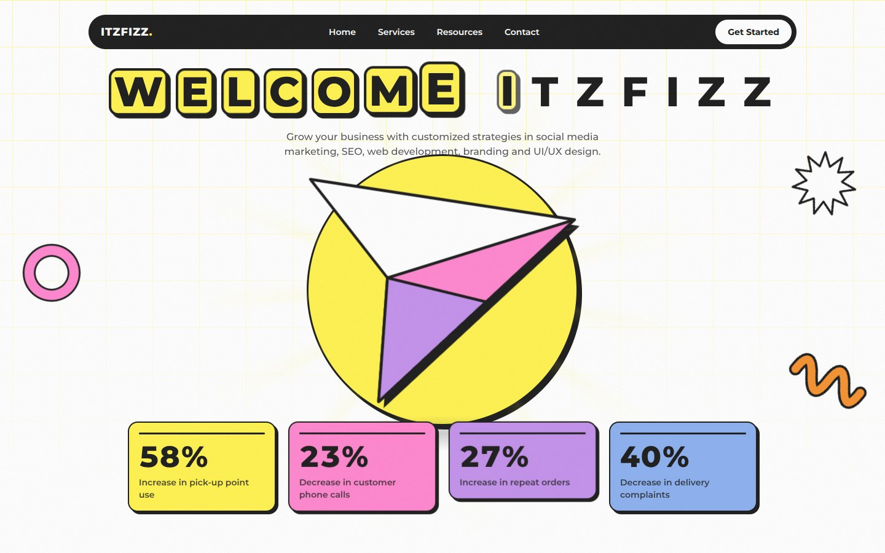

# Itzfizz Digital: scroll-driven hero

A hero section where a paper plane flies across the screen as you scroll. Built with **Next.js (React), Tailwind CSS, TypeScript and GSAP**, styled to match [itzfizz.com](https://itzfizz.com).



**Live demo:** https://akshat3021.github.io/itzfizz

## What it does

| Requirement                           | Implementation                                                                                                                                      |
| ------------------------------------- | --------------------------------------------------------------------------------------------------------------------------------------------------- |
| Letter-spaced headline above the fold | `W E L C O M E  I T Z F I Z Z`, centred, with impact stats below                                                                                    |
| Load animation                        | GSAP timeline: header and headline letters stagger in, the plane glides in from the left, then the stats appear one by one with counting numbers    |
| Scroll-based animation                | ScrollTrigger pins the hero for ~3 screens; the plane's `translateX` is **scrubbed to scroll progress**, with easing and smoothing (not time-based) |
| Smooth and performant                 | Only `transform` and `opacity` are animated; layout is read only on ScrollTrigger refresh, never in a scroll handler or per frame                   |

Driven by the same scroll progress:

- A yellow "sticker tile" pops in behind each headline letter as the plane flies over it.
- Each stat card bounces as the plane passes its column, one by one, left to right.
- The plane grows slightly and banks with its speed.
- A speed-line trail, sun rays, shadow and a small pool of particles react to the plane's _actual_ speed and fade when it stops.
- The grid and doodles drift and turn with the scroll; Lenis adds inertial smooth scrolling.
- Small details: "Scroll to accelerate" hint tied to scroll, mouse-only custom cursor, subtle film grain.

## Design: matched to itzfizz.com

Colours were sampled from the live site: yellow `#fff355`, ink `#222222`, plus its pink, lilac and blue. The look follows the same language: white page with a faint yellow grid, black pill navigation, bold geometric type (Montserrat), thick black outlines with hard offset shadows, a yellow disc behind the hero subject, and outlined doodles. The plane is an inline SVG, so it stays crisp at any size.

Copy, stats and nav links live in `lib/hero-content.ts`. The stats are **sample numbers** and the nav links other than Home are placeholders: replace them with real content.

## Run it

```bash
pnpm install
pnpm dev            # http://localhost:3000
pnpm typecheck
pnpm format         # Prettier (with Tailwind class sorting)
pnpm build          # static export to ./out
```

## Structure

```
app/                            layout (self-hosted font), page, global styles
components/hero/                presentational components (markup only)
  hero-plane.tsx                the SVG plane and its layers
  animation/
    config.ts                   every tuning value, in one place
    geometry.ts                 plane travel measurement, easing inversion
    plane-passes.ts             reactions when the plane flies over letters / cards
    speed-effects.ts            trail, rays, shadow, banking, particles (one ticker)
    particles.ts                recycled particle pool (no per-frame allocation)
    scroll-scene.ts             pinned, scroll-scrubbed timeline (the orchestrator)
    intro.ts                    time-based load animation
    use-hero-animation.ts       wires it up; handles prefers-reduced-motion
components/custom-cursor.tsx    mouse-only cursor
lib/hero-parts.ts               typed names that link markup to animation code
lib/hero-content.ts             all copy and stats
lib/smooth-scroll.ts            Lenis wired into GSAP's ticker
```

Markup and animation are decoupled by `hero('plane')`-style hooks from `lib/hero-parts.ts`. Both sides share the `HeroPart` type, so a typo is a compile error rather than a silently missing animation.

## Design decisions worth knowing

- **One owner per element property.** The intro and the scroll scene never animate the same element (letters, stat cards and the plane use nested wrappers), so scrolling mid-intro can't corrupt either. Scale (a timeline tween) and banking (a per-frame setter) are on separate wrappers because sharing one element silently broke both.
- **Pass timing is computed, not hand-tuned.** On each refresh, every letter's and card's position on the timeline is derived from its real x-position and the plane's easing curve (inverted numerically), so it stays correct at any screen size.
- **Layout cost was measured.** The letter tiles use `will-change: opacity`, which cut layouts per full scroll pass from 16 to 1.
- **Accessibility.** One real `<h1>` with screen-reader text; decorative elements are `aria-hidden`; pinch-zoom is allowed. With `prefers-reduced-motion` there is no intro, pinning, smooth scroll, cursor or particles, only the final state. With JavaScript off, everything is visible.
- **No flash on load.** A tiny inline script adds a `js` class before first paint, so intro elements start hidden only when GSAP will reveal them.

## Tuning

Everything lives in `components/hero/animation/config.ts`: pin length, smoothing, easing, bank angle, speed thresholds, and so on.

## Deploy to GitHub Pages

1. Push to a GitHub repo on the `main` branch.
2. **Settings → Pages → Source: GitHub Actions.**
3. The workflow in `.github/workflows/deploy.yml` builds and publishes. The base path comes from the repo name automatically.

